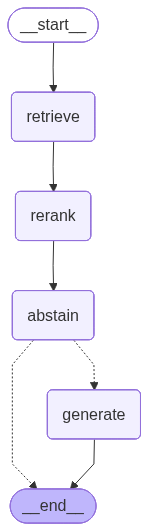

# Financial RAG

A retrieval-augmented generation pipeline that answers questions over 10-K financial reports (SEC EDGAR HTML filings), returning grounded answers with inline source citations, served over a FastAPI endpoint.

## What it does

The pipeline runs in six stages:

- **Ingest** (`src/services/ingest.py`) — EDGAR 10-K HTML is cleaned (scripts, styles, and iXBRL metadata stripped), split into chunks (3200 chars, 400 overlap, ~800 tokens), embedded with `text-embedding-3-small`, and persisted in ChromaDB (`data/chroma_db/`, collection `financial_reports`). Four reports are currently ingested: AAPL, JPM, KO, PFE.
- **Retrieve** (`src/agents/retrieve_agent.py`, `src/services/retrieve.py`) — similarity search over the vector store returns the top-20 candidate chunks for a query.
- **Rerank** (`src/agents/rerank_agent.py`) — a local cross-encoder (`ms-marco-MiniLM-L-6-v2`) reorders the 20 candidates and keeps the top 4.
- **Abstain** (`src/agents/abstain_agent.py`) — a relevance-threshold check on the reranked scores; if nothing is relevant, the graph exits before calling the LLM.
- **Generate** (`src/agents/generate_output_agent.py`, `src/prompts/generate_output_prompt.py`) — the LLM answers strictly from the retrieved context (temperature=0), citing sources inline as `[Company, chunk N]`.
- **Serve** — a LangGraph state machine (`src/graph/agent_graph.py`) wires the stages together; `POST /query` in `api/main.py` exposes the pipeline over HTTP.



## Design decisions

| Decision | Why |
|---|---|
| LangGraph instead of a plain chain | Conditional routing (abstain → early exit), explicit shared state, and a visualizable graph (`graph.png`) |
| Two-stage retrieval: k=20 → rerank to top 4 | Broad initial search for recall, cross-encoder rerank for precision |
| Local reranker, no external API | Avoids added latency/cost on a step that runs on every query |
| `text-embedding-3-small` | Cost/quality balance for financial text at this scale |
| Chunk size 3200 / overlap 400 chars | ~800 tokens, sized for dense financial prose; overlap avoids splitting facts across chunk boundaries |
| Temperature=0 + "answer only from context" prompt | Deterministic, anti-hallucination generation |
| Abstain-and-exit before generation | Never spend an LLM call on low-relevance retrieval. The relevance threshold is currently a stub (`RELEVANCE_THRESHOLD = 0.0`, marked `ponytail:` in code) — deliberately left untuned until eval data justified a real value |
| LLM client factory (`src/client_llm/`) | Single interface abstracts the provider (OpenAI now, Anthropic later); one cached instance per process |
| Inline citations `[Company, chunk N]` | Human-readable traceability to the source chunk, without a separate structured field — see Future Improvements |
| Semantic cache (`src/cache.py`): cosine distance ≤ 0.14, 24h TTL + invalidation on reindex | Avoids the LLM call for near-duplicate questions. Threshold picked via `eval/measure_cache_threshold.py`; known limitation: it can't reliably tell apart the same question asked about a different fiscal year (embeddings capture topic, not the exact year), so a same-year cache hit isn't guaranteed accurate for year-specific questions |

## Evaluation results

Generation quality is measured with `deepeval` over 4 ground-truth Q&A pairs on Apple's FY2025 10-K (`eval/eval_questions.json`). Reproduce with:

```bash
uv run python eval/run_eval.py
```

| Metric | Avg score | Pass rate |
|---|---|---|
| Faithfulness | 1.00 | 4/4 |
| Answer Relevancy | 0.96 | 4/4 |
| Contextual Recall | 1.00 | 4/4 |
| Contextual Precision | 0.48 | 3/4 |

Generation is fully grounded and relevant — faithfulness, recall, and relevancy are all near-perfect, meaning the LLM isn't hallucinating and isn't missing relevant chunks. Contextual precision is the weak point (worst case: the R&D question scored 0.25): the retriever/reranker sometimes ranks irrelevant chunks alongside the relevant one. This is a retrieval-ranking problem, not a hallucination problem.

## Future improvements

- Build the retrieval-layer eval planned in `PLAN.md` (`eval/eval_retrieval.py`, recall@k / MRR) to directly diagnose the contextual-precision gap above — `eval_questions.json` already has the `relevant_chunk_ids` ground truth needed for it.
- Improve retrieval ranking (chunking/reranker tuning) once that eval gives a baseline.
- Return structured sources in the API response (`documents` metadata: company, chunk_index) instead of only inline `[Company, chunk N]` text in the answer.
- Integrate Langfuse or LangSmith for production tracing of prompts and responses.
- Expand the eval set beyond AAPL — JPM, KO, and PFE are already ingested but have no ground-truth questions yet.
- Minor cleanup backlog tracked in `todo.md` (cosmetic diff in `agent_graph.py`, centralizing hardcoded strings/constants).
